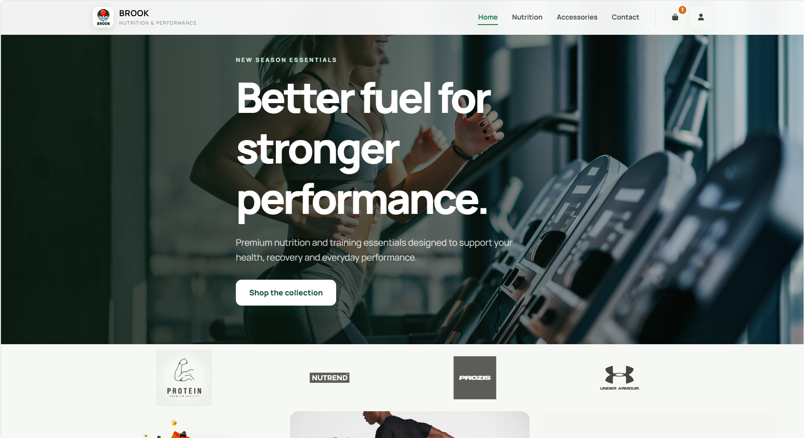
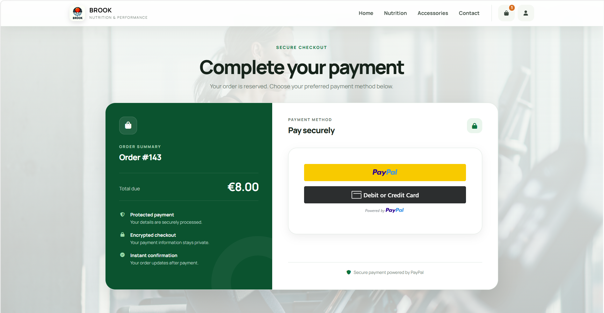

# Sports Nutrition E-commerce

This project is a small PHP and MySQL e-commerce website for sports nutrition, supplements, and fitness accessories.

It was developed in 2024 as an educational full-stack web development project for the **Information Systems** course at **Università Campus Bio-Medico di Roma (UCBM)**. The website demonstrates a complete local shopping flow, from product browsing to checkout and payment.




## Features

* Homepage with hero section and product highlights
* Nutrition product catalog with category and price filters
* Dedicated accessories catalog
* Product detail pages with image galleries
* Session-based shopping cart
* Checkout and order creation flow
* PayPal payment page
* User registration and login
* Account area with order history and spending statistics
* Detailed view for individual orders

## Payment Page

The payment page is designed to provide a clean, trustworthy, and professional checkout experience. It uses the PayPal JavaScript SDK on the client side and presents a familiar payment flow to the user.




## Technologies Used

* PHP
* MySQL
* MySQLi prepared statements
* HTML5
* CSS3
* Bootstrap 5
* Font Awesome
* Google Fonts
* PayPal JavaScript SDK
* XAMPP / Apache

## Database

The [`php_project.sql`](php_project.sql) dump creates and populates the `php_project` database. The main tables and views are:

* `users`
* `products`
* `product_images`
* `orders`
* `order_items`
* `payments`
* `order_summary`

The database stores registered users, product information, product images, orders, ordered items, payment records, and a summary view for order reporting.

## How to Run Locally

1. Install [XAMPP](https://www.apachefriends.org/) if it is not already available.

2. Copy or clone the project into the XAMPP `htdocs` directory:

   ```text
   C:\xampp\htdocs\sito
   ```

3. Start **Apache** and **MySQL** from the XAMPP Control Panel.

4. Open phpMyAdmin:

   ```text
   http://localhost/phpmyadmin
   ```

5. Create a new database named:

   ```text
   php_project
   ```

6. Import the database dump:

   ```text
   php_project.sql
   ```

7. Check the database credentials in [`server/connection.php`](server/connection.php). The default local configuration is:

   ```text
   host: localhost
   user: root
   password: empty
   database: php_project
   ```

8. Open the application in the browser:

   ```text
   http://localhost/sito/index.php
   ```

## Project Structure

```text
sito/
|-- assets/
|   |-- css/
|   |   `-- style.css
|   `-- imgs/
|       |-- home.png
|       |-- payment.png
|       `-- product and interface images
|-- layouts/
|   |-- footer.php
|   `-- header.php
|-- server/
|   |-- complete_payment.php
|   |-- connection.php
|   |-- get_bars.php
|   |-- get_featured_products.php
|   `-- place_order.php
|-- accessories.php
|-- account.php
|-- cart.php
|-- checkout.php
|-- contact.php
|-- index.php
|-- login.php
|-- order_details.php
|-- payment.php
|-- register.php
|-- shop.php
|-- single_product.php
|-- php_project.sql
`-- README.md
```


## Status

This is an educational prototype developed for the Information Systems course at UCBM in 2024. It is functional as a local demo and covers the main features of a basic e-commerce website, but it is not production-ready without security improvements.
